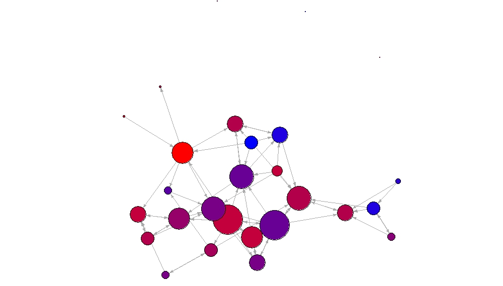

# Social Network Analysis (SNA) in Introductory Statistics Classrooms Project

## Project Description
I led a team of researchers in collecting and analyzing data on students' connections with one another in introductory psychology statistics classes to examine how connected lab sections were and to see whether connectedness within the lab section was associated with students' levels of grit and/or resilience.

We collected data at the end of the semester. Students were given a link to complete a survey via Google Forms and completed it on their own time.

## Measures

We created a social network survey, asking students 1) how they knew each of the other students in their lab section, if at all and 2) how close they were (0 = 'didn't know them' to 5 = 'very close') with that person. Connections were coded as mutual (each person knew the other), directed (one person knew another but that person did not reciprocate), or absent (neither student knew the other). We also had students complete the Short Grit Scale (GRIT-S) and the Brief Resilience Scale (BRS).

## Analyses

I used exponential random graph models (ERGMs) to investigate the association between students' connectedness and their levels of grit and resilience. Networks were fairly sparse, with only one, relatively well-connected lab, Lab 2, having a density of 0.10.

Example code for an ERGM looking at a difference in scores on the measures:
~~~ R
lab2.model1 = ergm(lab.2 ~ edges + mutual 
                    + diff("Grit", pow=1, dir="t-h", sign.action="identity")
                    + diff("BRS", pow=1, dir="t-h", sign.action="identity"))

summary(lab2.model1)
~~~

## Results
We found that students were not very well-connected within their lab sections and these sparse networks resulted in a lack of association between students' connections and their levels of grit and resilience. Lab 2 was more well-connected than the others and findings from that lab suggest that students may connect with other students who have similar levels of resilience and/or dissimilar levels of grit.

Below is a plot of the student network in Lab 2, the well-connected lab. Colors indicate a student's score on the grit scale: red indicates a low score, blue indicates a high score, and purple is an in-between score. Node size is based on degree, i.e., how many connections a student has in the lab. The more connections, the larger the node.

Code to create above plot:
~~~ R
########################
## Grit Network Graph ##
########################

#load library
library(RColorBrewer)

#generate color gradient starting at red and ending at blue
colfunc <- colorRampPalette(c("red", "blue"))
colfunc(18)

#plot gradient to check colors
plot(rep(1,18),col = colfunc(18), pch = 19, cex = 3)

#assign generated colors to object 'colors'
colors <- c("#FF0000", "#F0000F", "#E1001E", "#D2002C", "#C3003C", 
            "#B3004B", "#A50059", "#960069", "#870078", "#780087", 
            "#690096", "#5900A5", "#4B00B3", "#3C00C3", "#2D00D2",
            "#1E00E1", "#0F00F0", "#0000FF")

#color the nodes based on level of Grit using generated color gradient
V(lab.2)$color <- colors[V(lab.2)$Grit]

#compute node degree
deg <- degree(lab.2, mode = "all")

#set node size based on degree
V(lab.2)$size <- deg*3

#default labels are node ids, set them to NA
V(lab.2)$label <- NA

#change default arrow size and set edge color to be gray
E(lab.2)$arrow.size <- .2
E(lab.2)$edge.color <- "gray80"

#set layout of graph using Fruchterman-Reingold layout algorithm
l <- layout_with_fr(lab.2)

#rescale graph
l <- norm_coords(l, ymin = -0.95, ymax = 0.95, xmin = -0.95, xmax = 0.95)

#plot the network graph
plot(lab.2, rescale = FALSE, layout = l*1.5)
~~~
